<p align="center">
  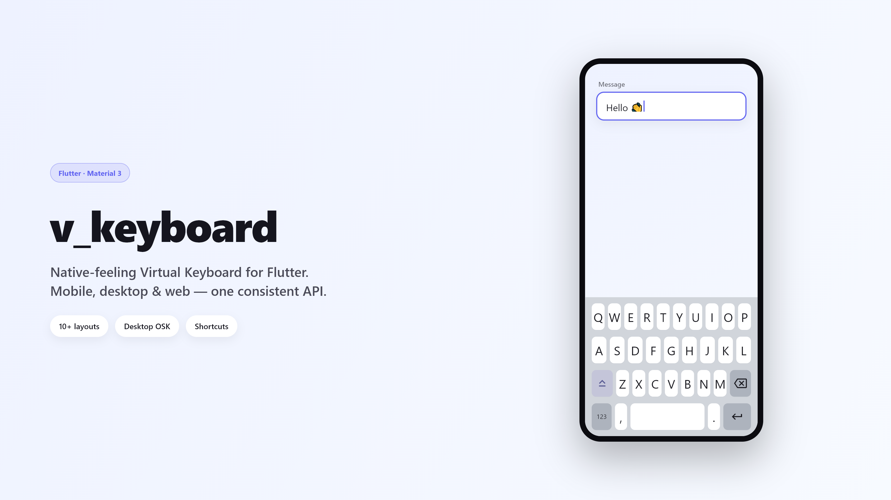
</p>

<h1 align="center">v_keyboard</h1>

<p align="center">
  A fully customizable, <b>native-feeling</b> virtual keyboard and text-input
  system for Flutter — Android · iOS · Windows · macOS · Linux · Web.
</p>

It is not just a keyboard widget: `VTextField` is a drop-in replacement
for `TextField` that integrates with Flutter's focus system and is driven by an
on-screen keyboard instead of the OS keyboard.

## Showcase

<table>
  <tr>
    <td align="center"><br><sub>Standard</sub></td>
    <td align="center">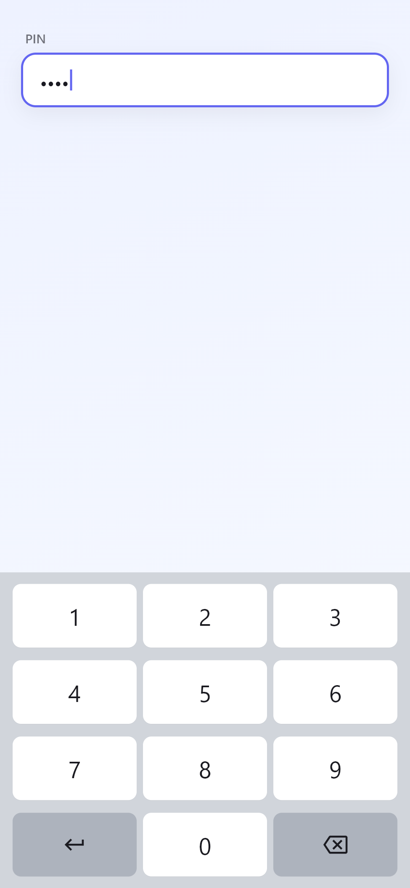<br><sub>PIN / Number</sub></td>
    <td align="center">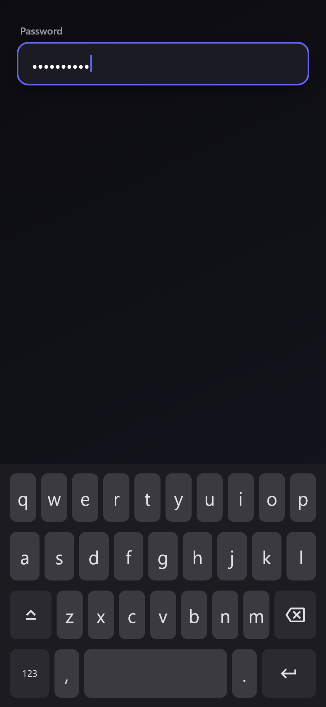<br><sub>Password (dark)</sub></td>
    <td align="center">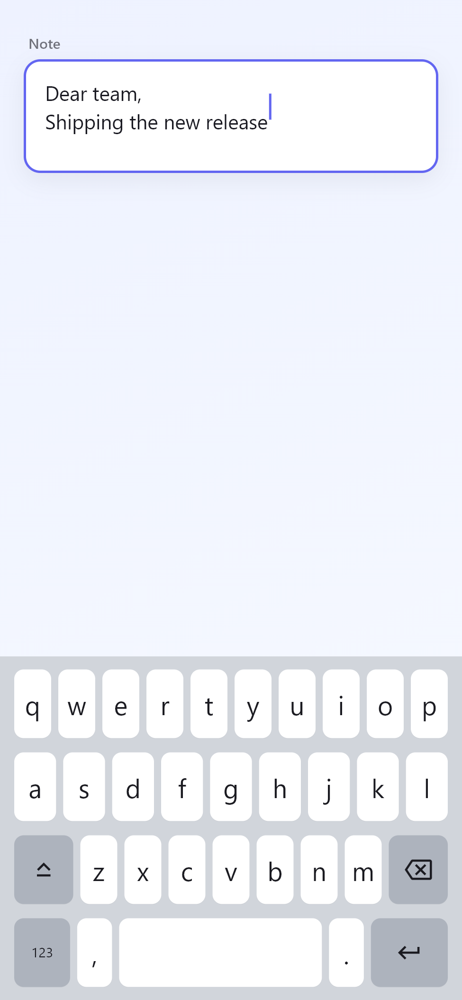<br><sub>Multiline</sub></td>
  </tr>
</table>

### Desktop (Windows OSK style)

<p align="center">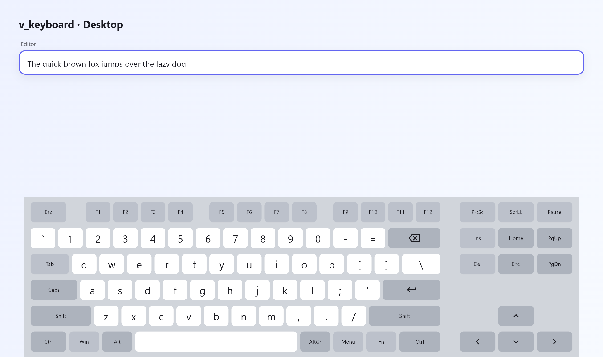</p>

### Responsive — phone · landscape · tablet · desktop

<p align="center">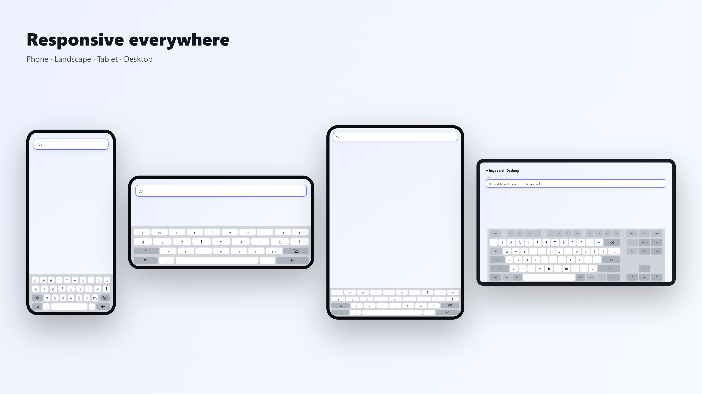</p>

### Light & dark themes

<table>
  <tr>
    <td align="center">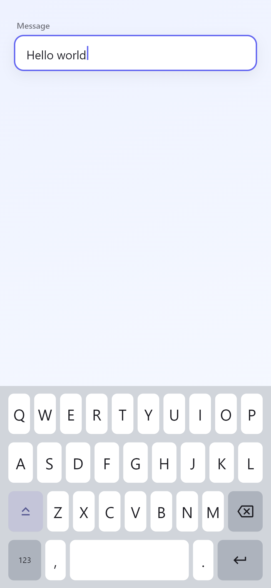<br><sub>Light</sub></td>
    <td align="center">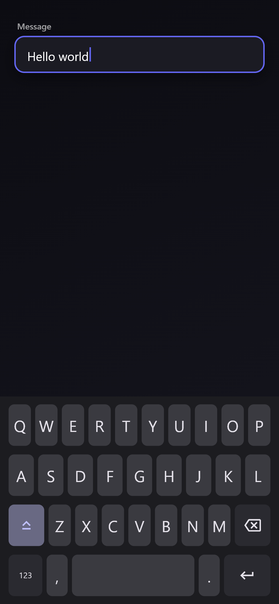<br><sub>Dark</sub></td>
  </tr>
</table>

### Features

<table>
  <tr>
    <td align="center">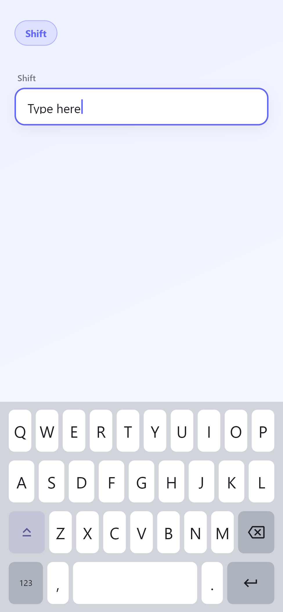<br><sub>Shift</sub></td>
    <td align="center"><br><sub>Caps Lock</sub></td>
    <td align="center">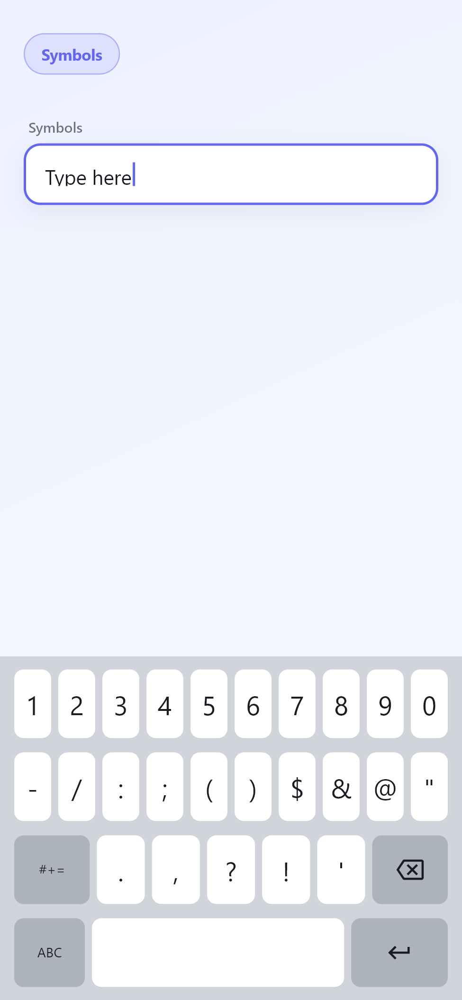<br><sub>Symbols</sub></td>
    <td align="center">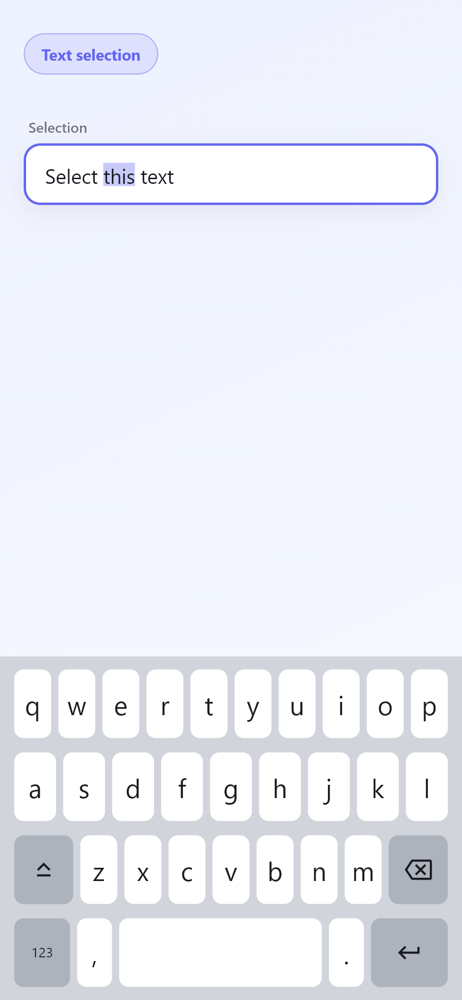<br><sub>Selection</sub></td>
    <td align="center">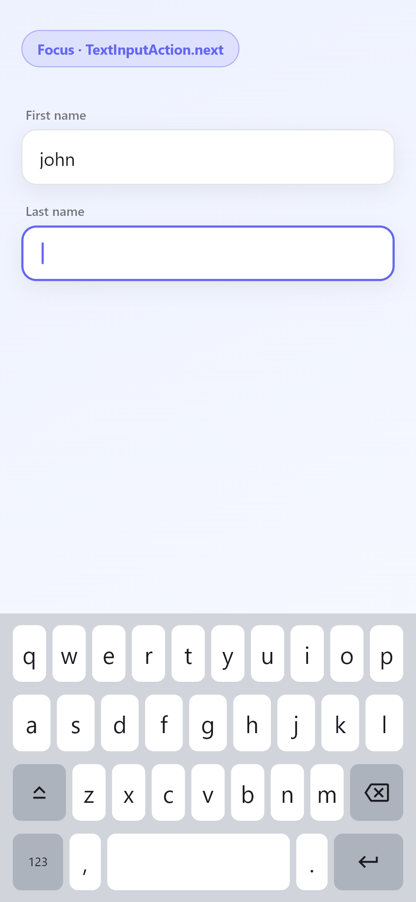<br><sub>Focus / Next</sub></td>
  </tr>
</table>

> Showcase images are generated from the real package widgets by
> `example/integration_test/showcase_test.dart` —
> `cd example && flutter test integration_test/showcase_test.dart -d windows`.

## Highlights

- Appears on focus, hides on blur — follows `FocusNode` naturally.
- Real cursor, selection, selection-replacement and multiline editing
  (built on a `readOnly` `TextField`, so it behaves natively).
- Pushes the UI up like the system keyboard (injects `viewInsets.bottom`).
- Long-press backspace + held-key repeat.
- Temporary shift, caps-lock (double-tap), `ABC / 123 / #+=` pages.
- Built-in layouts: standard, number, decimal, phone, pin, password, email,
  url, multiline, and fully **custom**.
- Full `TextInputAction` support (next/previous/done/go/search/send/newline…)
  respecting `FocusTraversalPolicy`.
- Responsive sizing for phone/tablet/desktop, portrait/landscape, resizable
  windows — heights are computed, never hard-coded; centred + width-limited on
  large desktop windows.
- Hardware-keyboard fallback on desktop/web.
- Per-key repaint (taps don't rebuild the whole keyboard), `RepaintBoundary`s,
  `ValueNotifier`-based pressed state.
- Material theming via `VKeyboardTheme`, behaviour via
  `VKeyboardConfig`. Semantics for screen readers.

## Quick start

Wrap your app once:

```dart
MaterialApp(
  builder: (context, child) => VKeyboardScope(child: child!),
  home: MyPage(),
);
```

Use `VTextField` like a `TextField`:

```dart
VTextField(
  controller: controller,
  focusNode: focusNode,
  keyboardType: VKeyboardType.standard, // note: `default` is reserved
  textInputAction: TextInputAction.next,
  onSubmitted: (value) {},
)
```

> **Naming note:** Dart reserves the word `default`, so the standard
> alphanumeric keyboard is `VKeyboardType.standard`.

## Custom layouts

```dart
final layout = KeyboardLayout(
  id: 'greek',
  initialPage: 'main',
  pages: {
    'main': [
      'αβγδε'.split('').map(KeyData.char).toList(),
      [KeyData.shift(), KeyData.space(), KeyData.backspace(), KeyData.enter()],
    ],
  },
);

VTextField(
  keyboardType: VKeyboardType.custom,
  customLayout: layout,
);
```

Custom keys (emoji/clipboard/voice/etc.) via `KeyData.custom(builder)` — no need
to fork the package.

## Configuration

```dart
VKeyboardScope(
  config: VKeyboardConfig(
    hideOnDone: true,
    moveFocusOnNext: true,
    closeOnOutsideTap: true,
    enableLongPressDelete: true,
    enableKeyRepeat: true,
  ),
  theme: VKeyboardTheme.fromTheme(Theme.of(context)),
  child: ...,
);
```

## Architecture

Cleanly separated, single-responsibility units:

| Concern           | Type                          |
|-------------------|-------------------------------|
| Orchestration     | `VKeyboardController`    |
| Per-field session | `KeyboardSession`             |
| Pure text editing | `TextInputEngine`             |
| Layouts/keys      | `KeyboardLayout`, `KeyData`, `BuiltinLayouts` |
| Actions           | `KeyboardActionHandler`       |
| Responsive sizing | `KeyboardMetrics`             |
| Rendering         | `KeyboardView`, `KeyboardKey` |
| Theme / config    | `VKeyboardTheme`, `VKeyboardConfig` |
| Host + insets     | `VKeyboardScope`        |

See [`example/`](example/lib/main.dart) for a full demo of every layout, a
custom layout, and the action callbacks.

## Desktop keyboard (Windows OSK style)

`VKeyboardType.desktop` renders a full physical keyboard: function row,
number row, full QWERTY, all modifiers (Ctrl/Alt/AltGr/Win/Menu, L+R Shift/Ctrl),
Caps/Num/Scroll Lock, navigation cluster (arrows, Home/End, Page Up/Down,
Insert/Delete), a numeric keypad and optional media keys. It is **responsive by
width** — sections collapse as the window narrows (media → numpad → function row),
typing keys always remain.

```dart
VTextField(
  keyboardType: VKeyboardType.desktop,
  maxLines: 5,
)
```

Supported behaviour: Shift/Caps casing, Ctrl/Alt/Meta modifier combos,
Shift+Arrow (extend selection), Ctrl+Arrow (by word), Home/End/PageUp/PageDown,
Ctrl+Backspace/Delete (word), built-in Ctrl+A/C/X/V clipboard, key repeat, and
hover/pressed/locked visual feedback.

Register custom shortcuts and desktop callbacks with `VKeyboardShortcuts`:

```dart
VKeyboardShortcuts(
  shortcuts: {
    LogicalKeySet(LogicalKeyboardKey.control, LogicalKeyboardKey.keyS): save,
  },
  onMedia: (intent) => player.handle(intent),
  onMetaKey: () => openStartMenu(),
  clipboardCallbacks: ClipboardCallbacks(onPaste: () => myPaste()),
  child: ...,
)
```

Desktop architecture (separate from mobile, shared controller/engine/focus):
`KeyboardModifierController`, `KeyboardNavigation`, `KeyboardShortcutManager`,
`ClipboardActions`, `DesktopLayouts`. Replace the whole layout (compact / gaming
/ POS / kiosk) by passing a `customLayout` with `VKeyboardType.desktop` or
`.custom`.

## Status

Production-oriented foundation with unit + widget tests
(`flutter test`). See `CHANGELOG`/issues for the remaining roadmap items
(emoji page UI, floating/docked desktop polish, integration tests).
